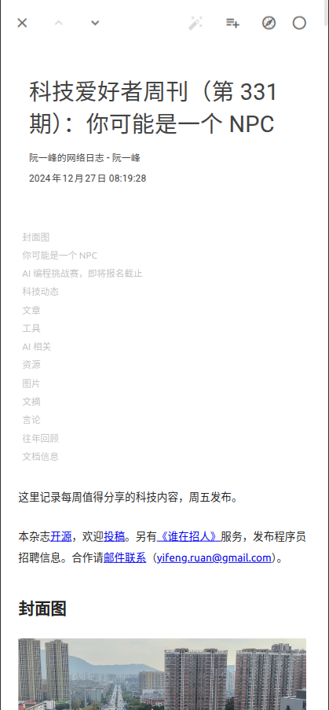
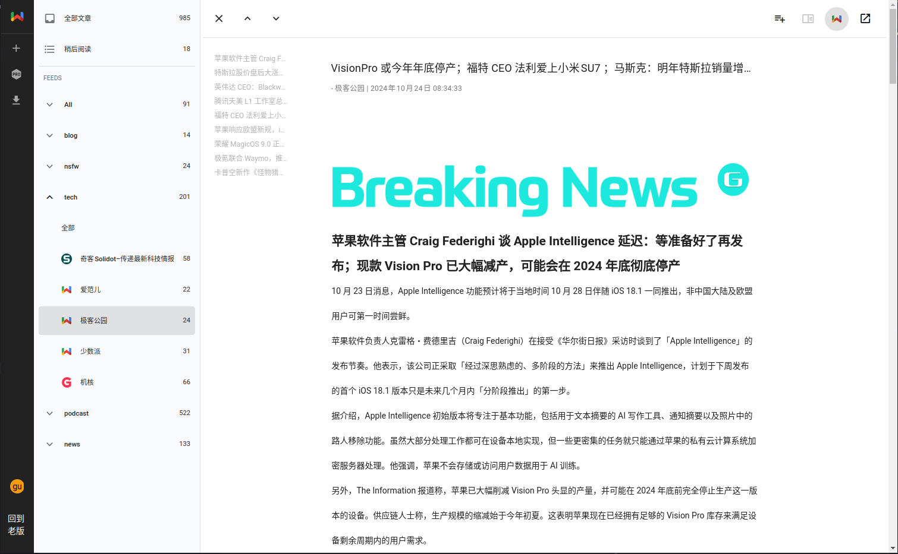
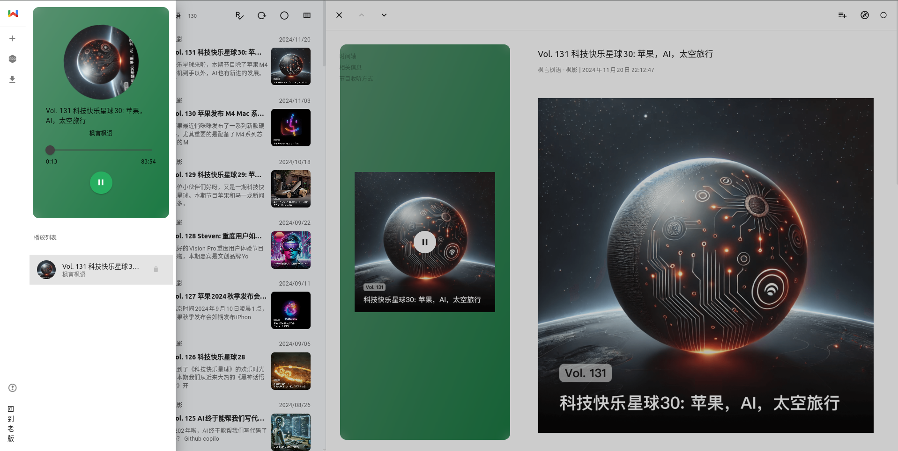
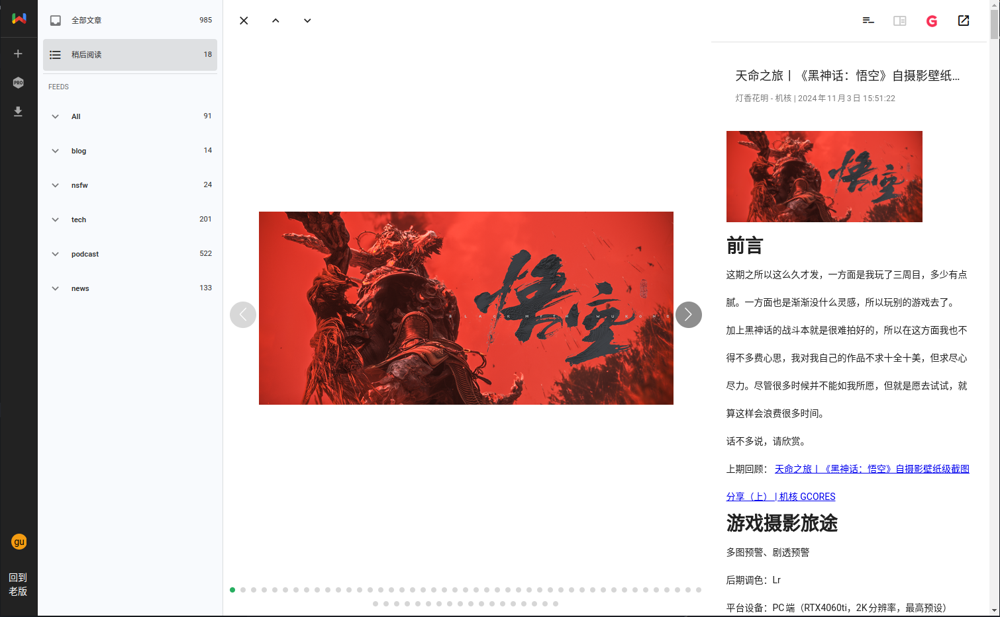
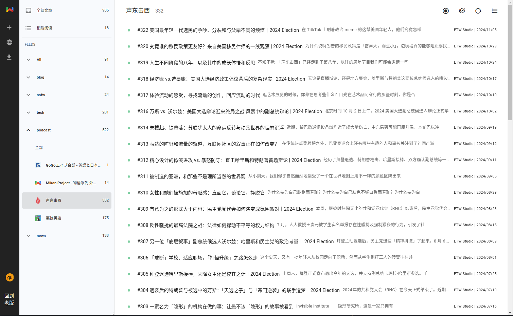
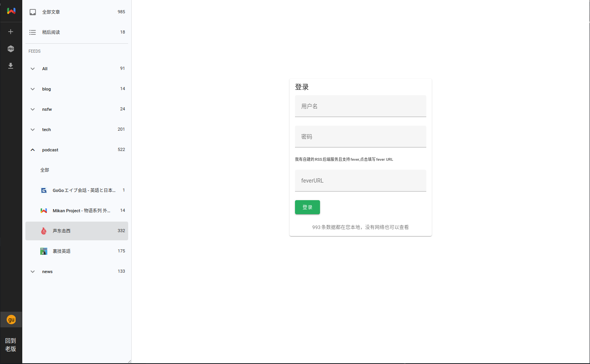
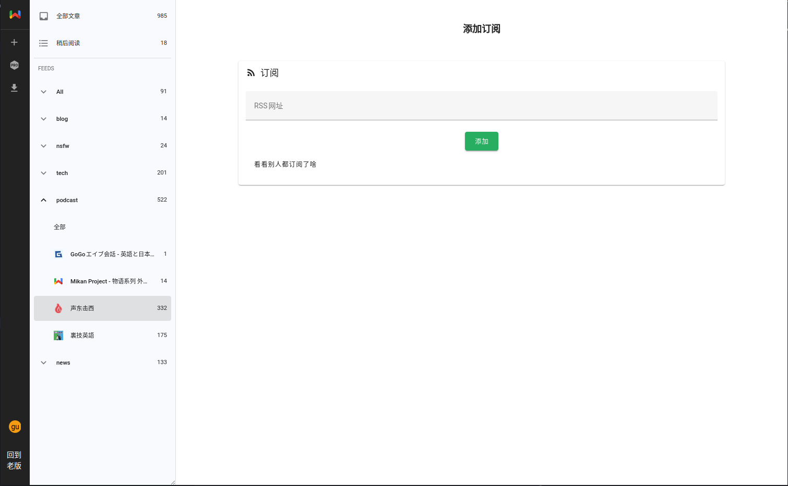

# webfollow-app

> RSS reader suppot fever api

- Strive to be the best reader experience
- 致力成为体验最佳的阅读器

## Feature

**feature**

- [x] fever api
- [x] data in local
- [x] ai search
- [x] recommend
- [x] llm summary
- [x] pwa

**base**

- [x] text-reader
- [x] podcast-reader
- [x] img-reader
- [x] video-reader
- [x] column-view
- [x] list-view
- [x] card-view

**todo list**

- [ ] export opml
- [ ] data reset

## Demo

[online](https://webfollow.cc)

## Preview

**AI**


**Mobile**




**PC**










## Use

```
npm install
```

```
npm run dev
```

## Notice

- Enhancements to feed subscription editing for fever
