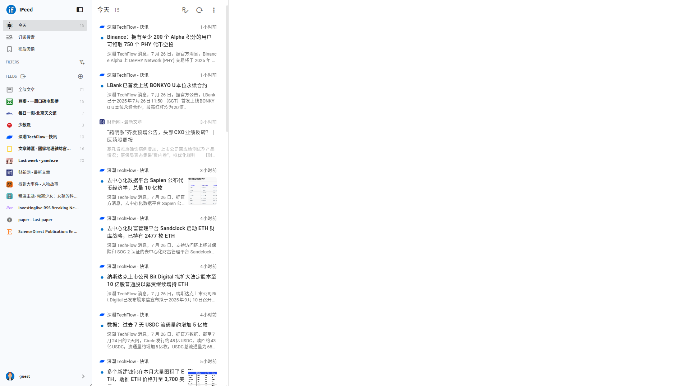
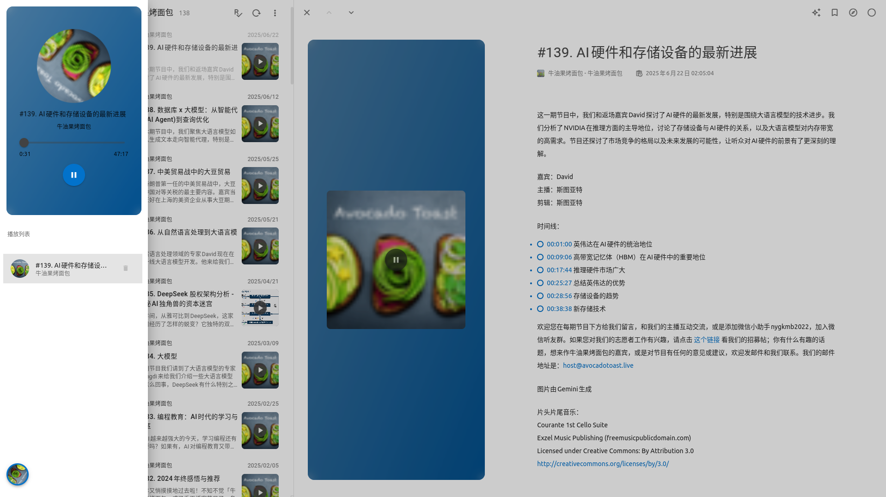

# IFeed

> 原名 webfollow


> RSS reader suppot fever api

- Strive to be the best reader experience
- 致力成为体验最佳的阅读器

## Feature

**feature**

- [x] fever api
- [x] data in local
- [x] ai search (rag)
- [x] recommend
- [x] llm summary + llm filter
- [x] pwa
- [x] List entry ai summary
- [x] List scroll mark as read

**base**

- [x] auto-reader
- [x] text-reader
- [x] podcast-reader
- [x] img-reader
- [x] video-reader
- [x] auto-list-view
- [x] column-list-view
- [x] list-list-view
- [x] card-list-view
- [x] text-list-view
- [x] content-list-view

**todo list**

- [ ] ai search 2.0 (mcp / function-call)
- [x] export opml
- [ ] data reset

## Demo

[online](https://webfollow.cc)

## Preview

**PC**







## Use

```
npm install
```

```
npm run dev
```

## Notice

- Enhancements to feed subscription editing for fever
